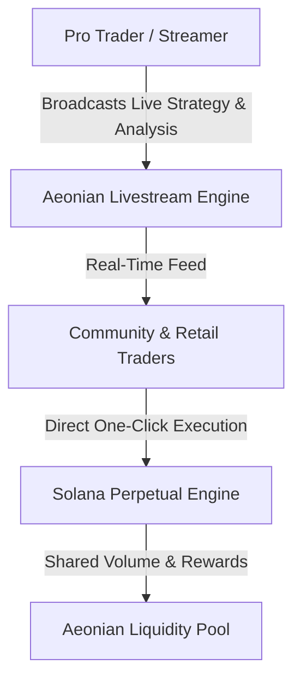

# The Social Layer for Solana Perps: Deconstructing Aeonian Trade & The Future of Live Trading Streams

**Author:** Dexter Mos (`@dextermos`)  
**Target Bounty:** Superteam Earn — *Write an X Thread Explaining Aeonian Trade & Introducing Upcoming Livestreams* by Aeonian  
**Platform:** [aeonian.trade](https://aeonian.trade)  
**Payout Address (EVM / Base / Solana):** `0x8366bCe3a2D379Dec7656D7A67015789FaF999f20`  

---

## 🧵 Thread Breakdown / Full Research Paper

### 1/10: The Problem with Solitary Perp Trading
Perpetual trading on decentralized exchanges has historically been an isolated experience: numbers on a chart, lonely order books, and fragmented alpha scattered across private Telegram channels. While Solana unlocked sub-second settlement and fractions-of-a-cent execution, the *human social dynamic* was completely missing.

Enter **Aeonian Trade** ([aeonian.trade](https://aeonian.trade))—the first purpose-built **Social Perpetual DEX on Solana**.

---

### 2/10: What is Aeonian Trade?
Aeonian Trade merges high-speed perpetual DEX infrastructure with an active social layer. Instead of treating trading as a purely mechanical transaction, Aeonian builds a community ecosystem where traders discover each other, verify performance transparently on-chain, share setups, and earn collective rewards.

```
┌────────────────────────────────────────────────────────┐
│               AEONIAN TRADE ARCHITECTURE               │
├──────────────────────────┬─────────────────────────────┤
│   High-Performance DEX   │     Social Interaction      │
│   • Sub-second Solana TP │     • On-Chain Profiles     │
│   • Deep Liquidity Pools │     • Verified Win-Rates    │
│   • Minimal Slippage     │     • Interactive Streams   │
└──────────────────────────┴─────────────────────────────┘
```

---

### 3/10: Ultra-Fast Solana Perps for Every Trader
Built natively on Solana, Aeonian delivers:
- **Instant Execution:** Zero lag on market orders, limit entries, and stop-loss triggers.
- **Deep Liquidity & Low Slippage:** Trade major assets (SOL, BTC, ETH, and trending ecosystem tokens) with robust leverage.
- **Non-Custodial Security:** You retain full ownership of your capital at all times through your self-custody wallet (Phantom, Backpack, Solflare, MetaMask).

---

### 4/10: Verified Trader Profiles & On-Chain Reputation
On traditional platforms, "traders" post screenshots that can be faked. On Aeonian:
- Every trader gets an **On-Chain Profile**.
- Historical PnL, win-rates, trade frequency, and risk metrics are immutably tied to the trader’s profile.
- You can follow top-performing strategists with zero guesswork.

---

### 5/10: Introducing Upcoming Livestreams: The Game-Changer
The most anticipated feature landing on Aeonian Trade is **Interactive Livestreams**.
Trading is no longer a silent solitary grind. With Livestreams:
- Pro traders and KOLs can stream their live charting, trade entries, and risk management in real time.
- Viewers can watch, comment, discuss strategy, and execute trades directly alongside the streamer inside the same seamless UI.



---

### 6/10: Why Livestreams Transform Social Trading
- **Live Alpha in Real Time:** No more waiting for delayed tweet threads; see entries the exact second they happen.
- **Educational Masterclasses:** Learn how seasoned traders manage drawdowns, position sizing, and leverage in volatile conditions.
- **Gamified Engagement:** Chat, tip, cheer, and participate in community trade challenges during high-volatility events (CPI releases, token launches).

---

### 7/10: The Referral & Rewards Engine
Aeonian Trade heavily incentivizes community growth through a multi-tiered referral and reward system:
- **Earn on Volume:** Refer friends and earn a percentage of fees generated on their perp volume.
- **Trader Badges & Loyalty Points:** Active participation, consistent trading, and social contributions unlock exclusive platform perks and fee discounts.

---

### 8/10: Who is Aeonian Trade Built For?
1. **Degen & Scalp Traders:** Who demand lightning-fast order matching on Solana with minimal fee drag.
2. **Content Creators & Trading Streamers:** Who want to monetize their alpha, build a following, and stream directly on a native DEX.
3. **Emerging Traders:** Who want to learn from verified on-chain winners and avoid fake screenshots.

---

### 9/10: How to Get Started in 3 Steps
1. Visit [aeonian.trade](https://aeonian.trade).
2. Connect your Solana / EVM wallet.
3. Set up your Trader Profile, deposit collateral, and join the social perp movement.

---

### 10/10: Summary & Vision
Perpetual trading shouldn't be lonely. By unifying high-speed Solana execution, transparent on-chain profiles, and real-time interactive Livestreams, **Aeonian Trade is creating the social future of decentralized finance.**

---
*Authored by Dexter Mos (`@dextermos`).*  
*Submission for Superteam Earn Aeonian Bounty.*  
*Verification & Code Hub: [github.com/dextermos/genesis-bounty-hunter](https://github.com/dextermos/genesis-bounty-hunter)*
