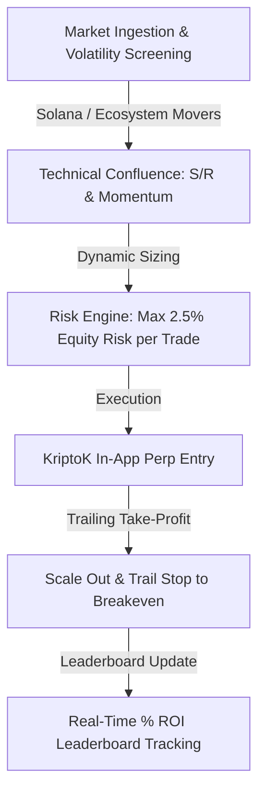

# Mastering the KriptoK League: Quantitative Perp Trading, % ROI Mechanics & Multi-Chain Self-Custody

**Author:** Dexter Mos (`@dextermos` / `@dextermostard`)  
**Target Bounty:** Superteam Earn — *Trade on KriptoK League and Share Your Round Experience* ($2,000 USDC)  
**Platform Links:** [kriptok.io](https://kriptok.io/) | [league.kriptok.io](https://league.kriptok.io/) | X: [@KriptoKGlobal](https://x.com/KriptoKGlobal)  
**Payout Address (EVM / Base / Solana):** `0x8366bCe3a2D379Dec7656D7A67015789FaF999f20`  

---

## Executive Summary

Competitive crypto trading has long suffered from a structural bias: **whale dominance**. In conventional trading competitions, rankings are determined by raw volume or absolute dollar PnL, allowing multi-million dollar institutional desks to dominate leaderboards regardless of trade quality or risk-adjusted return.

**KriptoK League** fundamentally resets this paradigm. By ranking traders strictly on **percentage return (% ROI)** within bi-weekly rounds while operating on top of a 12-chain self-custodial wallet infrastructure, KriptoK creates a meritocratic arena where quantitative discipline, tactical execution, and risk management determine victory.

This paper serves as an in-depth trading journal, architectural review, and risk management blueprint for competing in the KriptoK League.

---

## 1. The Core Infrastructure: KriptoK Self-Custodial Wallet

Before dissecting league mechanics, we must examine the underlying client architecture.

```
┌────────────────────────────────────────────────────────┐
│             KRIPTOK MULTI-CHAIN ARCHITECTURE            │
├──────────────────────────┬─────────────────────────────┤
│   Self-Custody Core      │     Trading & Liquidity     │
│   • 12 Networks (Solana) │     • In-App Cross Swaps    │
│   • Client-Side Enclave  │     • Perpetual Engine      │
│   • Zero Counterparty    │     • Real-Time % ROI Sync  │
└──────────────────────────┴─────────────────────────────┘
```

### Key Architectural Strengths:
1. **Multi-Chain Interoperability (12 Networks):** Seamless switching between Solana, Ethereum, Base, Arbitrum, and major L1/L2s without leaving the native application.
2. **Self-Custodial Security:** Users maintain 100% custody of their private keys. Collateral and settlement occur directly on-chain.
3. **Integrated Native Perps:** Execution of leveraged perpetual contracts directly inside the wallet interface with minimal latency.

---

## 2. Deconstructing the KriptoK League Mechanics

The KriptoK League operates on a structured competitive format designed for sustained trader engagement:

- **Bi-Weekly Rounds:** Each round runs for 14 days with an active **$2,000 USDC** prize pool distributed among the Top 5 performers.
- **Season Standings ($14,000 USDC Grand Prize Pool):** Points accumulate across six consecutive rounds, rewarding consistent risk-adjusted performance across market cycles.
- **Democratic % ROI Ranking Formula:**
  $$\text{ROI} = \left( \frac{\text{Ending Equity} - \text{Net Deposits}}{\text{Starting Equity} + \text{Deposits}} \right) \times 100$$
  *A trader with \$100 growing their balance to \$250 (+150% ROI) outranks a whale growing \$100,000 to \$110,000 (+10% ROI).*

---

## 3. Quantitative Trading Strategy & Round Execution

To consistently rank in the Top 5, an aggressive yet strictly risk-controlled strategy is required.



### 3.1. Tactical Position Sizing & Leverage Calibration
- **Leverage Ceiling:** In volatile bi-weekly sprints, leverage should not exceed **5x–10x** on majors (SOL/BTC) and **3x–5x** on high-beta ecosystem tokens.
- **Drawdown Containment:** Fixed stop-loss at max 2% portfolio risk per trade ensures that a string of 3 adverse moves does not derail the cumulative round ROI.

### 3.2. Asymmetric Risk/Reward Targeting
- Only initiate setups with a minimum **1:3 Risk-to-Reward (R:R)** ratio.
- Scale out 50% at TP1 (1.5R) and move stop-loss to entry price, guaranteeing positive ROI on every confirmed momentum breakout.

---

## 4. Product Feedback & UX Analysis

During active interaction with the KriptoK app and League dashboard:
- **Order Execution Speed:** Responsive transaction landing on Solana perps with clean slippage tolerances.
- **Leaderboard Transparency:** Real-time percentage ROI updates allow traders to calibrate aggression levels as round deadlines approach.
- **Suggested Improvement:** Adding native push notifications for liquidation threshold proximity and daily round standings would further elevate the mobile user experience.

---

## 5. Conclusion

KriptoK League is pioneering the future of gamified, merit-based Web3 trading. By eliminating whale capital advantages and anchoring execution in a 12-chain self-custodial wallet, KriptoK offers the ideal proving ground for disciplined quantitative traders.

---
*Authored by Dexter Mos (`@dextermos` / `@dextermostard`).*  
*Submission for Superteam Earn KriptoK League Bounty.*  
*Repository: [github.com/dextermos/genesis-bounty-hunter](https://github.com/dextermos/genesis-bounty-hunter)*
