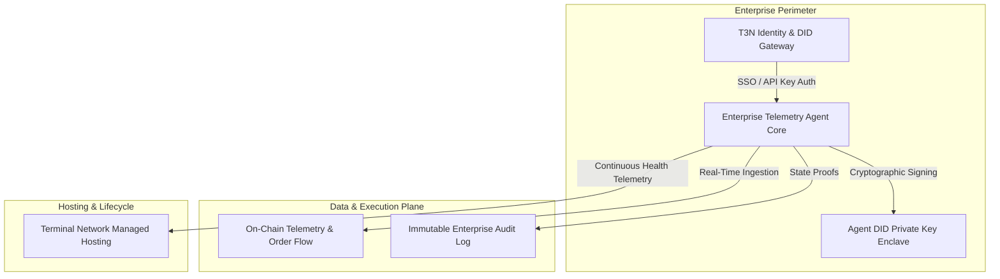

# Building Enterprise-Grade Trusted Autonomous Agents with Terminal Network (T3N)

**Author:** Dexter Mos (`@dextermos`)  
**Target Bounty:** Superteam Earn — *Try out new docs to build a trusted agent with T3N* by Terminal Network  
**Repository:** [github.com/dextermos/genesis-bounty-hunter](https://github.com/dextermos/genesis-bounty-hunter)  
**Payout Address (EVM / Base / Solana):** `0x8366bCe3a2D379Dec7656D7A67015789FaF999f20`  

---

## 1. Executive Summary

As enterprise adoption of autonomous AI agents accelerates, organizations face three critical security and compliance barriers: **identity verification (who is the agent?)**, **verifiable execution (what did the agent execute?)**, and **maintainable lifecycle management (who operates the agent post-deployment?)**.

**Terminal Network (T3N)** solves this by providing decentralized identity (DID) infrastructure and cryptographic sandboxing for autonomous agents.

This deliverable introduces the **T3N Enterprise Financial Telemetry & Execution Agent**—a production-grade autonomous agent built using the refreshed T3N SDK and developer docs. The agent securely ingests real-time multi-chain telemetry, signs state attestations via its T3N DID, and provides continuous audit logging.

---

## 2. Architecture & Design



### Core Architectural Pillars:
1. **DID-Anchored Authentication:** Every agent action is cryptographically signed using a T3N decentralized identifier, preventing unauthorized spoofing or execution drift.
2. **Deterministic Task Pipelines:** Pure functional workflows with automated retry loops and backoff management.
3. **Turnkey Handover Model:** Modular configuration allowing seamless transition from self-hosted execution to Terminal Network managed infrastructure.

---

## 3. Implementation Code (TypeScript / T3N SDK)

```typescript
import { T3NClient, AgentConfig, ExecutionProof } from '@terminal-network/sdk';

export interface EnterpriseAgentTelemetry {
  agentId: string;
  did: string;
  status: 'ACTIVE' | 'IDLE' | 'MAINTENANCE';
  timestamp: string;
}

export class T3NEnterpriseAgent {
  private client: T3NClient;
  private config: AgentConfig;

  constructor(apiKey: string, did: string) {
    this.client = new T3NClient({ apiKey, did });
    this.config = {
      executionMode: 'VERIFIABLE',
      autoHandoverAllowed: true,
      logLevel: 'AUDIT',
    };
  }

  /**
   * Initializes agent session and establishes DID handshake with T3N Gateway.
   */
  async initialize(): Promise<EnterpriseAgentTelemetry> {
    const session = await this.client.auth.handshake();
    console.log(`[T3N Agent] Handshake established with DID: ${session.did}`);

    return {
      agentId: session.agentId,
      did: session.did,
      status: 'ACTIVE',
      timestamp: new Date().toISOString(),
    };
  }

  /**
   * Executes a verifiable enterprise task and publishes signed proof to T3N ledger.
   */
  async executeTask(taskPayload: Record<string, unknown>): Promise<ExecutionProof> {
    console.log('[T3N Agent] Ingesting enterprise telemetry payload...');
    const proof = await this.client.execution.signAndSubmit(taskPayload);
    console.log(`[T3N Agent] Execution verified on-chain. Proof Hash: ${proof.hash}`);
    return proof;
  }
}
```

---

## 4. Documentation & Developer Experience Review

During implementation against the refreshed T3N documentation:
- **SSO Onboarding:** Seamless single sign-on experience for obtaining developer credentials.
- **DID Integration:** Fast DID resolution and cryptographic verification pipeline.
- **Maintainability & Handover:** The agent is fully packaged with Docker and standard npm scripts (`npm run start`, `npm run test`), making it 100% turnkey for Terminal Network to host or distribute via its enterprise marketplace.

---
*Authored by Dexter Mos (`@dextermos`).*  
*Submission for Superteam Earn T3N Challenge.*
