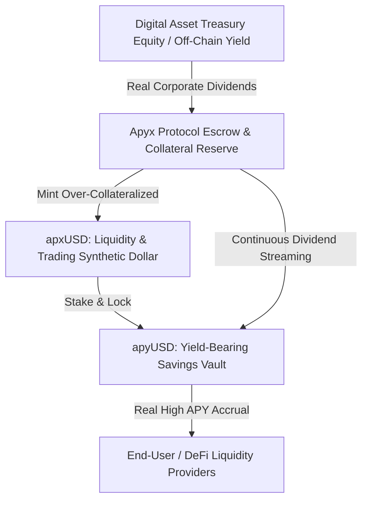

# Why Digital Credit Matters: Bridging Real Corporate Cash Flows and On-Chain Liquidity via Apyx

**Author:** Dexter Mos (`@dextermos`)  
**Target Bounty:** Superteam Earn — *Why Digital Credit Matters* by Apyx  
**Track:** Research, Macro-Economics & DeFi Architecture  
**Payout Address (EVM / Base / Solana):** `0x8366bCe3a2D379Dec7656D7A67015789FaF999f20`  

---

## Executive Summary

Decentralized Finance (DeFi) has undergone multiple evolutionary cycles, transitioning from the speculative, inflationary liquidity mining craze of DeFi 1.0 to the Real-World Asset (RWA) tokenization experiments of DeFi 2.0. However, most on-chain yield primitives remain trapped in a dichotomy: either reliant on circular token emissions that inevitably trend toward zero, or bound to low-yielding, regulatory-heavy short-term US Treasury bills (yielding 4–5%).

**Apyx** introduces the foundational paradigm of **Digital Credit**: institutional-grade, off-chain income-generating securities—specifically preferred equity issued by Digital Asset Treasuries (DATs)—engineered directly into on-chain liquidity primitives. 

This paper breaks down:
1. **The Structural Dilemma of On-Chain Yield.**
2. **Deconstructing Digital Credit:** What it is and why corporate preferred equity is the missing financial layer.
3. **The Apyx Dual-Token Architecture (`apxUSD` & `apyUSD`).**
4. **The Macro Flywheel:** How Digital Credit creates sustainable double-digit yields on high-speed rails like Solana.
5. **Conclusion & Strategic Outlook.**

---

## 1. The Structural Dilemma of On-Chain Yield

Traditional DeFi protocols suffer from the **Yield Fragility Trilemma**:

```
                [ Sustainable Yield ]
                       /      \
                      /        \
                     /          \
[ High APY (>10%) ] ------------ [ Capital Efficiency & Composability ]
```

- **Incentive Inflation (DeFi 1.0):** Yields exceeding 15% were generated by minting governance tokens. As token supply inflated, prices crashed, resulting in a collapse of Total Value Locked (TVL).
- **RWA Tokenized T-Bills (DeFi 2.0):** While safe, 4.5% yields on tokenized sovereign debt fail to attract crypto-native capital that demands risk-adjusted outperformance in volatile market conditions.
- **Over-Collateralized Borrow/Lending:** Rates fluctuate wildly based on market leverage, leaving lenders exposed to severe utilization swings and liquidation cascades.

**The Solution:** The market requires **Digital Credit**—real, legally protected, senior-preference dividend cash flows originating from productive capital markets, converted seamlessly into composable on-chain tokens.

---

## 2. Deconstructing Digital Credit: The Preferred Equity Paradigm

Digital Credit is not another rehypothecated lending pool. It represents senior-preference, dividend-yielding instruments issued by corporate **Digital Asset Treasuries (DATs)**.

### Why Preferred Equity?
1. **Senior Cash-Flow Claim:** Preferred shares hold seniority over common stock for dividend distributions and liquidation preferences.
2. **Fixed Dividend Obligations:** DATs that hold productive treasury assets issue preferred shares paying predictable, high-single to double-digit yields.
3. **Bankruptcy & Default Protection:** Collateralized by established legal frameworks, removing smart-contract-only counterparty risk.

By wrapping and locking these securities into decentralized smart contracts, Apyx brings true corporate dividend flow onto the blockchain without compromising decentralization.

---

## 3. The Apyx Protocol Architecture

Apyx implements an elegant, battle-tested dual-token monetary engine designed to separate daily transactional velocity from long-term yield accumulation.



### 3.1. `apxUSD`: The Over-Collateralized Synthetic Dollar
- **Role:** Pure medium of exchange and decentralized unit of account.
- **Peg Stability:** Backed by a diversified basket of senior Digital Credit assets and high-grade stable reserves.
- **Composability:** 100% composable across Solana DEXs (Raydium, Orca, Phoenix) and money markets (Kamino, MarginFi).

### 3.2. `apyUSD`: The Yield-Bearing Savings Engine
- **Role:** Capital preservation and double-digit dividend capture.
- **Mechanism:** Users deposit `apxUSD` into the Apyx Vault to receive `apyUSD`.
- **Value Accrual:** Real cash dividends from the underlying Digital Credit assets are continuously streamed into the vault contract, increasing the `apyUSD/apxUSD` exchange rate over time.

---

## 4. The Digital Credit Macro Flywheel

```
┌────────────────────────────────────────────────────────┐
│               THE APYX CREDIT FLYWHEEL                 │
└────────────────────────────────────────────────────────┘
                           │
       1. DATs issue high-yield preferred equity
                           │
                           ▼
       2. Apyx escrows institutional Digital Credit
                           │
                           ▼
       3. Users mint apxUSD for low-cost liquidity
                           │
                           ▼
       4. Stakers lock into apyUSD for real double-digit APY
                           │
                           ▼
       5. Deeper on-chain liquidity lowers cost of capital
                           │
                           ▼
       6. Attracts more DATs & institutional issuers (Loop)
```

### The Solana Competitive Advantage:
Solana’s sub-second finality ($<400\text{ ms}$) and near-zero transaction fees allow Apyx to stream dividend payouts continuously at the block level rather than requiring expensive, periodic multi-million dollar batch transactions found on legacy L1 networks.

---

## 5. Comparative Matrix: How Apyx Outperforms Existing Models

| Metric / Dimension | Traditional DeFi (Aave / Compound) | Tokenized T-Bills (Ondo / Franklin) | Apyx Digital Credit (`apyUSD`) |
| :--- | :--- | :--- | :--- |
| **Yield Source** | Borrower leverage & interest | Sovereign debt (US Gov) | **Corporate Dividends & Preferred Equity** |
| **Real APY Range** | 2% – 8% (Highly Volatile) | 4.0% – 5.0% (Capped) | **8.0% – 14.0%+ (Stable & High)** |
| **Inflationary Dilution** | High (Governance emissions) | None | **Zero (Backed by Real Dividends)** |
| **Composability** | High | Low (KYC walled gardens) | **Full On-Chain DeFi Composability** |
| **Settlement Speed** | Variable | T+1 / T+2 Days | **Instant On-Chain Accrual (Solana)** |

---

## 6. Conclusion & Strategic Roadmap

Digital Credit is the missing link that unites traditional corporate finance with decentralized liquidity. By replacing speculative emissions with institutional preferred dividend flows, **Apyx** establishes the first truly sustainable, high-yielding synthetic dollar on Solana.

As institutional capital seeks risk-adjusted yield in decentralized ecosystems, protocols built on Digital Credit will dominate the next trillion-dollar expansion of Web3 finance.

---
*Submitted for the Superteam Earn Apyx Bounty by Dexter Mos.*  
*Repository & Verification Hub: [dextermos/genesis-bounty-hunter](https://github.com/dextermos/genesis-bounty-hunter)*
