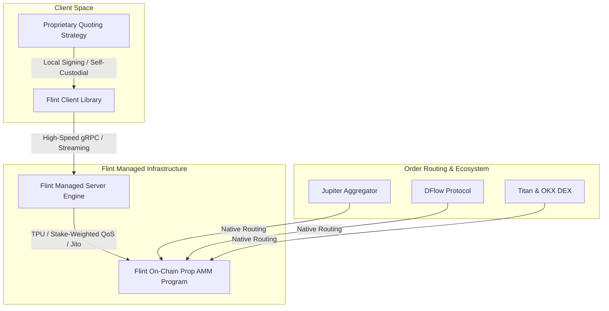

# Why Flint Beats Building Your Own Prop AMM: The Institutional Market Making Thesis on Solana

**Author:** Dexter Mos (`@dextermos`)  
**Target Bounty:** Superteam Earn — *Post: Why Flint Beats Building Your Own Prop AMM* by Flint  
**Track:** DeFi Architecture, Quantitative Market Making & High-Frequency Trading  
**Payout Address (EVM / Base / Solana):** `0x8366bCe3a2D379Dec7656D7A67015789FaF999f20`  

---

## Executive Summary

Providing competitive on-chain liquidity on Solana is one of the most lucrative yet technically punishing frontiers in decentralized finance. For quantitative trading firms and market makers, the historical dilemma has been stark: **Build an in-house proprietary Automated Market Maker (Prop AMM)** from scratch or settle for standard, passive Constant Product AMM pools with severe toxic order flow and adverse selection.

Building a custom Prop AMM requires 6+ months of hardcore low-level systems engineering—writing custom Rust on-chain programs, maintaining bespoke gRPC validator streams, managing Jito MEV block-space bundles, and negotiating custom routing integrations with DEX aggregators.

**Flint** completely upends this "build vs. buy" calculation. By delivering a battle-tested, managed Prop AMM infrastructure with **multi-maker pro-rata matching** and **instant aggregator routing (Jupiter, DFlow, Titan)**, Flint allows trading desks to deploy capital and quote live liquidity on Day 1 while retaining 100% self-custody of their keys.

This paper provides an engineering and economic breakdown of why using Flint fundamentally outclasses building an in-house Prop AMM.

---

## 1. The Engineering Nightmare of the In-House Prop AMM

To understand Flint’s value proposition, we must dissect the true architectural cost of building a proprietary on-chain market-making stack on Solana.

```
┌────────────────────────────────────────────────────────────────────────┐
│                   IN-HOUSE PROP AMM HIDDEN DEBT                         │
└────────────────────────────────────────────────────────────────────────┘
  1. On-Chain AMM Program (Rust / Anchor / Audits: $100k+, 3-4 months)
  2. Sub-Second Cluster State & Yellowstone gRPC Geyser Pipelines
  3. TPU Transaction Landing Engine (SWQoS, Priority Fees, Jito Bundles)
  4. Custom Routing & API Negotiations with Aggregators (Jupiter, DFlow)
  5. Constant Maintenance against Solana Core Breaking Upgrades (v1.18+)
```

### The Three Silent Killers of In-House AMMs:
1. **Adverse Selection & Toxic Order Flow:** A single market maker quoting in isolation absorbs 100% of informed flow and toxic arbitrage from latency arbitrageurs.
2. **Opportunity Cost & Delayed Alpha:** Six months spent building plumbing is six months where market conditions evolve, yields compress, and competitors capture market share.
3. **Aggregator Friction:** DEX aggregators route volume based on execution reliability and liquidity depth. Negotiating routing parameters for a solo AMM is time-consuming and often deprioritized.

---

## 2. Deconstructing the Flint Architecture

Flint decomposes the market-making pipeline into three modular, high-performance layers:



### 2.1. The Prop AMM Venue (On-Chain Engine)
- Optimized Solana program engineered for sub-millisecond execution and minimal compute units (CU).
- Implements dynamic fee tiers and programmable spread adjustments.

### 2.2. The Managed Server Infrastructure
- Handles high-throughput reading/writing to the Solana cluster.
- Integrates direct validator connections, Stake-Weighted QoS (SWQoS), and private transaction landing rails (Jito-Solana).

### 2.3. The Self-Custodial Client SDK
- Ergonomic Python/TypeScript/Rust client libraries.
- Translates quantitative price curves into atomic transactions.
- **Zero Custodial Risk:** Private keys and trading logic never leave the firm's private enclave.

---

## 3. Core Competitive Advantages: Flint vs. In-House Build

| Dimension / Metric | In-House Proprietary AMM | Flint Managed Prop AMM |
| :--- | :--- | :--- |
| **Time-to-Market** | 6 – 9 Months | **Day 1 Deployment (<24 Hours)** |
| **Initial Capital Expenditure** | $250,000+ (Engineering + Audits) | **Zero Upfront Infra Cost** |
| **Aggregator Integration** | Manual negotiation per DEX | **Instant Out-of-the-Box Routing (Jupiter, DFlow, Titan, OKX)** |
| **Risk Distribution** | Solo desk bears 100% adverse flow | **Multi-Maker Pro-Rata Risk Sharing** |
| **Network Upgrades & Maintenance** | Dedicated DevOps team required | **Managed 24/7 by Core Flint Engineers** |
| **Custodial Security** | Self-managed | **100% Self-Custodial SDK** |
| **Institutional Backing** | Unverified | **Solana Foundation Frontier Traders Approved** |

---

## 4. The Multi-Maker Advantage: Shared Depth, Reduced Risk

Flint’s signature innovation is its **Multi-Maker Pro-Rata Matching Engine**.

Instead of a single firm attempting to provide the entire depth for a volatile pair:
- Multiple quantitative firms quote into the unified Flint venue simultaneously.
- When an aggregator routes a multi-million dollar swap, the trade is filled **pro-rata** across all quoting participants.
- **Economic Result:** Deeper combined order books, tighter spreads, higher aggregator fill priority, and vastly reduced toxic inventory drawdowns for individual desks.

---

## 5. Conclusion: Focus on Alpha, Not Plumbing

In high-frequency decentralized trading, competitive edge comes from **alpha generation, risk modeling, and pricing speed**—not from rebuilding foundational RPC pipelines and AMM smart contracts.

By eliminating 6+ months of infrastructure drag, providing native aggregator connectivity, and introducing multi-maker risk sharing, **Flint is the definitive infrastructure standard for institutional market making on Solana.**

Trading desks that leverage Flint move faster, quote tighter, and capture more volume while their competitors are still debugging their validator connections.

---
*Submitted for the Superteam Earn Flint Bounty by Dexter Mos.*  
*Repository & Verification Hub: [dextermos/genesis-bounty-hunter](https://github.com/dextermos/genesis-bounty-hunter)*
