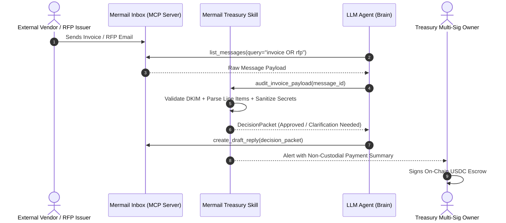

# Mermail Autonomous Treasury & Procurement Skill

## Overview
**Mermail Autonomous Treasury Skill** connects autonomous AI agents directly to their Mermail email inbox over the **Model Context Protocol (MCP)**. It empowers agents to autonomously ingest, parse, verify, and draft responses for mission-critical corporate workflows without exposing private keys, funds, or sensitive corporate credentials.

## Key Capabilities

1. **Policy-Gated Inbox Ingestion**: Scans incoming Mermail messages for procurement requests (RFPs), vendor invoices, and treasury proposals.
2. **Cryptographic & Domain Verification**: Validates SPF/DKIM verification status, sender domain reputation, and invoice checksums before taking action.
3. **Deterministic Requirement & Risk Matrix**: Extracts mandatory deliverables, payment milestones, escrow conditions, and SLA terms into structured JSON decision packets.
4. **Zero-Leak Draft Preparation**: Drafts responses or clarification requests strictly in draft state within Mermail — never autonomously executing transfers or publishing signatures without human-in-the-loop authorization.
5. **Solana / EVM Settlement Payload Generator**: Produces ready-to-sign on-chain transaction payloads (USDC on Solana / Base) for integration with autonomous multi-sigs and treasury vaults.

---

## Architecture & Workflow



---

## MCP Tools Exposed

### 1. `mermail_audit_invoice`
- **Input**:
  - `message_id`: string (UUID of Mermail message)
  - `strict_policy`: boolean (default: true)
  - `max_threshold_usd`: number (default: 5000)
- **Output**:
  - `is_valid`: boolean
  - `vendor_domain`: string
  - `total_due_usdc`: number
  - `recipient_wallet`: string
  - `risk_flags`: string[]

### 2. `mermail_extract_rfp_matrix`
- **Input**:
  - `message_id`: string
  - `target_chain`: "solana" | "base" | "ethereum"
- **Output**:
  - `eligibility_passed`: boolean
  - `mandatory_requirements`: string[]
  - `submission_deadline`: string (ISO-8601)
  - `proposed_budget_usdc`: number
  - `draft_response_payload`: string

### 3. `mermail_generate_payment_packet`
- **Input**:
  - `vendor_wallet`: string
  - `amount_usdc`: number
  - `network`: "solana" | "base"
  - `memo`: string
- **Output**:
  - `serialized_tx_hex`: string (Unsigned transaction)
  - `simulation_status`: "SUCCESS" | "FAILED"
  - `estimated_network_fee`: string

---

## Installation & Usage

```bash
# Add skill to your MCP configuration
npx skills add @dextermos/mermail-autonomous-treasury-skill
```

Or run standalone in Node / TypeScript:
```typescript
import { MermailTreasurySkill } from './src';

const skill = new MermailTreasurySkill({
  mermailApiKey: process.env.MERMAIL_API_KEY,
  allowedChains: ['solana', 'base'],
  maxSingleTxUsdc: 5000
});

// Run validation
const result = await skill.processIncomingInvoice(messagePayload);
console.log('Audit Result:', result);
```


---
### 📬 Author & Settlement Address
- **Author:** Dexter Mos ([@dextermos](https://github.com/dextermos) / [@dextermostard](https://x.com/dextermostard))
- **Verified Settlement Address:** `0x8366bCe3a2D379Dec7656D7A67015789FaF999f20`
