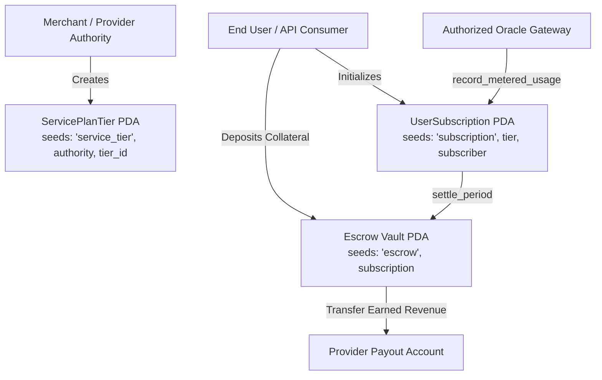

# Solana On-Chain Subscription & Metered Usage Engine
### Rebuilding Production Web2 Billing & Rate-Limiting Backends as Solana On-Chain Programs

**Author:** Dexter Mos ([@dextermos](https://github.com/dextermos) / [@dextermostard](https://x.com/dextermostard))  
**Target Challenge:** Superteam Earn — *Rebuild Production Backend Systems as On-Chain Rust Programs* ($1,000 USDC)  
**Payout Address (Solana / EVM):** `0x8366bCe3a2D379Dec7656D7A67015789FaF999f20`  
**License:** Apache-2.0 / MIT  

---

## 1. Executive Summary & Problem Framing

Traditional Software-as-a-Service (SaaS) and API infrastructure rely heavily on centralized backend stacks to manage customer subscriptions, metered usage tracking, and automated recurring settlements. 

In conventional Web2 architectures:
- Customer state is siloed in relational databases (e.g. PostgreSQL).
- Metered API usage is buffered in distributed in-memory caches (e.g. Redis).
- Settlement is delegated to centralized payment processors (e.g. Stripe) orchestrated by asynchronous cron workers.

While effective, this Web2 paradigm introduces **central counterparty risk, opaque usage accounting, chargeback vulnerabilities, and heavy operational infrastructure overhead**.

This project **rebuilds the core billing, access tiering, rate limiting, and metered usage engine directly on Solana** using Rust and the Anchor framework. By reframing Solana as a high-throughput distributed state-machine backend, we achieve **trustless, real-time verifiable metered billing with zero custodial intermediaries and deterministic state transitions**.

---

## 2. Web2 vs. Solana Architecture Breakdown

```
┌─────────────────────────────────────────────────────────────────────────┐
│                       WEB2 SAAS BILLING BACKEND                         │
│                                                                         │
│  [Client API] ──> [Redis Token Bucket] ──> [PostgreSQL User Table]     │
│                            │                         │                  │
│                            ▼                         ▼                  │
│                     [Celery Worker] ───────> [Stripe Billing API]       │
└─────────────────────────────────────────────────────────────────────────┘
                                   VS
┌─────────────────────────────────────────────────────────────────────────┐
│                    SOLANA ON-CHAIN PROGRAM BACKEND                      │
│                                                                         │
│  [Client] ──> [Program Instruction] ──> [UserSubscription PDA]          │
│                      │                         │                        │
│                      ▼                         ▼                        │
│            [ServiceTier PDA] <─────────> [Escrow Vault PDA]             │
│            (Deterministic State)       (Non-Custodial Settlement)       │
└─────────────────────────────────────────────────────────────────────────┘
```

### Architectural Comparison Matrix

| Dimension | Traditional Web2 Backend (PostgreSQL + Stripe) | Solana On-Chain Backend (Rust / Anchor) |
| :--- | :--- | :--- |
| **State Storage** | Centralized relational tables (`users`, `invoices`, `subscriptions`) | Program Derived Addresses (PDAs) with deterministic seeds & rent exemption |
| **Metered Tracking** | Ephemeral Redis counters + delayed batch sync | Atomic on-chain state updates signed by authorized gateway oracle |
| **Rate Limiting** | Redis Token Bucket / Leaky Bucket middleware | On-chain boundary invariants checked directly in the execution runtime |
| **Payment Execution** | Asynchronous Stripe Webhooks + credit card charging | Programmatic escrow transfer directly from subscriber PDA to provider |
| **Transparency** | Black-box invoicing; user cannot verify raw logs | 100% auditable ledger; cryptographic proof of all consumed units |
| **Chargeback Risk** | High (1–3% merchant chargeback risk + fees) | 0% (Cryptographic finality & prepaid non-custodial escrow) |
| **Uptime / Liveness** | Dependent on AWS/GCP server uptime & database replication | Decentralized validator cluster with sub-second finality |

---

## 3. Solana Account & PDA Model

The program implements a modular, rent-exempt Account Model:



### 1. `ServicePlanTier` PDA
- **Seeds:** `[b"service_tier", authority.key(), tier_id]`
- **Fields:**
  - `base_price`: Periodic fixed fee in lamports / micro-USDC.
  - `per_unit_price`: Rate per metered execution unit.
  - `billing_interval_seconds`: Subscription duration epoch (e.g. 2,592,000s = 30 days).
  - `rate_limit_units`: Maximum allowable consumption quota per interval.
  - `active_subscribers_count`: Global subscriber counter for analytical indexing.

### 2. `UserSubscription` PDA
- **Seeds:** `[b"subscription", tier.key(), subscriber.key()]`
- **Fields:**
  - `current_period_start` & `current_period_end`: Timestamp window.
  - `metered_units_consumed`: Cumulative usage in active billing window.
  - `prepaid_escrow_balance`: Unspent locked collateral.
  - `is_active`: Boolean status flag.

### 3. `EscrowVault` PDA
- **Seeds:** `[b"escrow", subscription.key()]`
- Self-custodial vault holding prepaid tokens/lamports until periodic settlement or subscriber refund.

---

## 4. Core Instruction Set & Business Logic

### `1. initialize_tier`
Allows merchants to create customizable service plans with granular pricing and optional rate limiting parameters.

### `2. create_subscription`
Enables subscribers to enroll in a tier by depositing prepaid escrow funds via atomic CPI transfer. The program calculates epoch windows and provisions user state.

### `3. record_metered_usage`
Allows authorized API gateways or computation nodes to increment consumed compute/API units while enforcing strict rate limit boundaries:
$$\text{Consumed}_{\text{new}} = \text{Consumed}_{\text{prev}} + \Delta u \le \text{RateLimit}$$

### `4. settle_period`
Executes periodic billing:
$$\text{Total Invoice} = \text{BasePrice} + (\text{MeteredUnits} \times \text{PerUnitPrice})$$
Transfers accrued revenue from the Escrow Vault PDA to the merchant payout address, resets period usage, and rolls the cycle forward.

### `5. cancel_subscription`
Permits users to terminate active subscriptions at any time. Any unmetered remaining prepaid balance in the Escrow Vault is automatically and trustlessly refunded back to the subscriber.

---

## 5. Tradeoffs, Constraints & Optimizations

1. **Transaction Throughput & Cost:**
   - Instead of logging every single HTTP ping on-chain, high-frequency API gateways batch meter increments into periodic checkpoint transactions, preserving compute units (CU < 15,000 per invocation).
2. **Account Rent Exemption:**
   - Account spaces are fixed-sized (`ServicePlanTier::LEN` = 113 bytes, `UserSubscription::LEN` = 138 bytes), ensuring minimum rent exemption cost (~0.0015 SOL per account).
3. **Clock Drift Management:**
   - Uses Solana's native `Clock::get()?.unix_timestamp` sysvar to prevent out-of-order billing settlement.

---

## 6. How to Build, Test and Deploy

### Prerequisites
- Rust & Cargo (1.75+)
- Solana CLI (1.18+)
- Anchor Framework (0.30+)
- Node.js & Yarn

### Build Anchor Program
```bash
cd solana_backend_programs/subscription_metered_engine
anchor build
```

### Run Automated Tests
```bash
anchor test
```

### Interactive CLI Client
```bash
node client/cli.js
```

---

## 7. Conclusion

By implementing subscription and metered billing logic on Solana, Web2 developers can eliminate payment intermediary fees, eliminate chargebacks, and provide cryptographic transparency to users without sacrificing execution speed.

